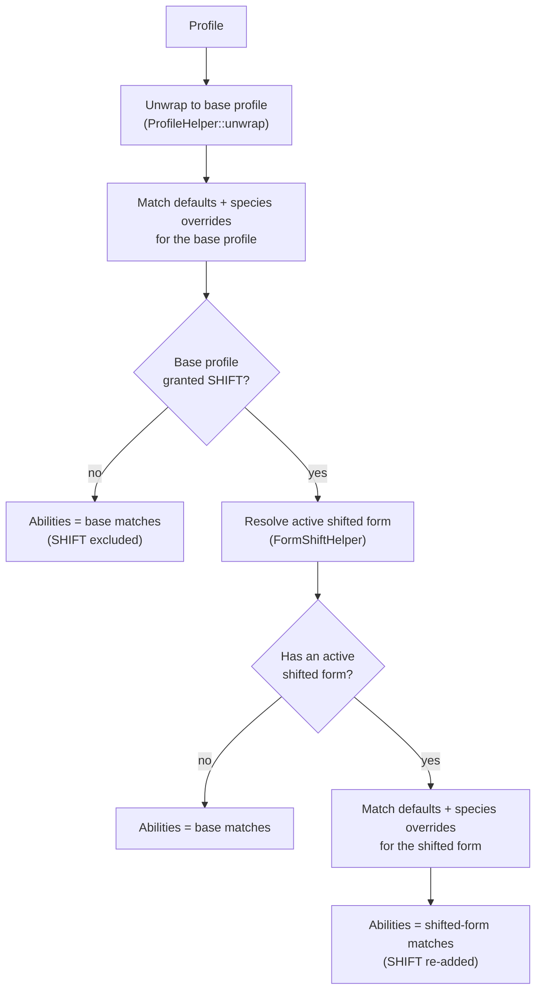

# Abilities

## For end-users

### What abilities are

An ability is a special action a character can take beyond the usual
menu-driven scenes, offered from **MyProfile → Abilities** in-world (and
mirrored on the [dashboard](companion-dashboard.md)'s Abilities panel).
Whether your character has access to a given ability depends on your
character's species, current form, and class — it's something the
world/story runner configures, not something you toggle yourself. If your
character doesn't currently qualify for an ability, its menu simply won't
offer it.

The abilities available today:

| Ability | What it does |
|---|---|
| **Transmute (Shift)** | Change between forms you've learned. See [Form Shapeshifters](form-shapeshifters.md) for what shifting actually changes about your character. |
| **Bite** | Bite a nearby character (within about 10 metres), draining a small amount of their health and defense and sampling a taste of their blood. |

### Using Bite

Choose **Bite** from the Abilities menu (or the dashboard's Abilities panel),
then pick a character within range from the list offered — only characters
seen nearby recently are listed. Biting them:

- Costs the target roughly 5% of their vitality (health) and 10% of their
  defense.
- Gives you a small taste of their blood, described by its flavor.
- Notifies the target that they were bitten and what they lost.

If the character you picked has moved out of range or stopped being available
since the menu opened, you'll be asked to search again rather than the bite
silently failing or landing on the wrong person.

### Things to keep in mind

- Not every character has every ability — some are restricted to particular
  species, forms, or classes, and that restriction is set up ahead of time by
  whoever configures the world, not by the player.
- Shift's availability doesn't necessarily mean you already have any
  particular alternate form learned — that's a separate matter of which
  disguises you've picked up (see [Form Shapeshifters](form-shapeshifters.md)).

---

## For developers

### `AbilityTypeEnum`

`AbilityTypeEnum` (`src/classes/enums/AbilityTypeEnum.php`) is the closed set
of abilities: `SHIFT` (`ability.shift`, displayed as "Transmute") and `BITE`
(`ability.bite`, displayed as "Bite"). Each case carries its own
`toValue()` display label, `getDescription()` player-facing blurb, and
`getApiHandle()` — the name of the helper class that serves that ability's
own detail surface on the dashboard (`AbilityShiftHelper` /
`AbilityBiteHelper`), used so a generic client can route a selected ability to
the right panel without a hardcoded switch. Adding a new ability means adding
a case here plus its own helper/dialog pair (see Extension points, below).

### Two-layer grant model

Eligibility is **not** hardcoded per form (that was the pre-existing
behaviour before this system existed). Instead it is driven by two database
tables, both populated by direct configuration rather than any in-world or
dashboard authoring UI — there is no wizard for these; rows are created
directly against the schema (see `ddl/Abilities.sql` /
`ddl/SpeciesAbilities.sql`):

| Table / entity | Selector columns | Meaning |
|---|---|---|
| `ane_abilities` / `AbilityModelImpl` (`AbilityRepository`) | `ability`, optional `form`, optional `class` | A **species-independent default** grant: any profile whose form/class matches (a `null` selector matches anything) gets the ability, *unless* a species override exists for that ability (see below). |
| `ane_species_abilities` / `SpeciesAbilityModelImpl` (`SpeciesAbilityRepository`) | `species`, `ability`, optional `form`, optional `class` | A **per-species override**. Once any row exists for a given `(species, ability)` pair, that species' eligibility for that ability is decided *only* by its own override row(s) — the general default for that ability no longer applies to that species at all, even for form/class combinations none of the species' own rows mention. |

Both tables generate a stored `scope` column (`form:class`, or
`species:form:class`) purely to carry a database-level uniqueness constraint
across wildcard (`NULL`) combinations — `uniq_ability_scope` /
`uniq_species_ability_scope` — alongside a plain-column uniqueness constraint,
so two rules can't be inserted for the same effective scope by mistake, even
via a direct SQL write.

> **Overrides replace, they don't add.** A species can have several override
> rows for the same ability (e.g. one scoped to a form, one scoped to a
> class) — matching *any one* of them grants the ability. But as soon as one
> override row exists for `(species, ability)`, the species-wide default for
> that ability is gone entirely for that species; it does not fall back to
> the general default for form/class combinations none of the species' rows
> cover. An override with no form/class restriction at all effectively grants
> the ability to every form/class of that species, even overriding a more
> restrictive default. This is deliberate — see
> `AbilityRepository::fetchAbilities()`'s inline comment — but it means a
> narrowly-scoped species override can end up *revoking* an ability from some
> of that species' forms/classes compared to the default, which is easy to
> get wrong when authoring rules by hand.

### Resolving eligibility (`SpeciesAbilityHelper`)

`SpeciesAbilityHelper` (`src/classes/helpers/SpeciesAbilityHelper.php`) is the
single place both the in-world dialog and the dashboard route through:

- `fetchAbilities(ProfileModel $profile): AbilityTypeEnum[]` — the profile's
  full set of granted abilities.
- `hasAbility(ProfileModel $profile, AbilityTypeEnum $ability): bool` — a
  single-ability check.

Physical abilities (currently just Bite) follow the **worn form** — a
character disguised as something with Bite can bite while shifted, and one
disguised as something without it cannot, regardless of their real species.
Shift itself is always evaluated against the **base** profile: changing form
can never remove your own ability to change back. `hasAbility()` special-cases
`SHIFT` to skip the "does the currently-worn disguise still resolve" check
that `fetchAbilities()` performs for other abilities, so a stale/invalid saved
disguise never blocks shifting back.

Matching itself (`fetchMatchingAbilities()`, private) merges
`AbilityRepository::fetchAbilities()` (remaining defaults not overridden for
this species) with `SpeciesAbilityRepository::fetchAbilities()` (this
species' own override grants matching the profile's form/class), de-duplicates
by the enum's backing value, and returns them ordered by that value.

### Dashboard surface

- **`AbilityHelper`** (`/api?class=AbilityHelper`) — lists every
  `AbilityTypeEnum` case with its label, description, `handle` (the detail
  helper's class name), and whether the active profile currently has it
  (`SpeciesAbilityHelper::fetchAbilities()`). This is the web equivalent of
  the in-world **MyProfile → Abilities** menu (`ProfileAbilitiesDialog`).
- **`AbilityShiftHelper`** (`/api?class=AbilityShiftHelper`) — the Shift
  ability's own detail surface (learned forms, current form, switching).
  Availability now checks `SpeciesAbilityHelper::hasAbility(..., SHIFT)`
  instead of the old hardcoded "is this profile's form
  `FormTypeEnum::FORM_SHIFT`" check; `RolePlayService::doShift()` (the
  in-world shift action itself) was changed the same way, so both surfaces
  agree on eligibility.
- **`AbilityBiteHelper`** (`/api?class=AbilityBiteHelper`, and subscribed as
  an `InteractionSubscriber` for the cross-account notification) — see below.

### Bite mechanics (`AbilityBiteHelper`)

`AbilityBiteHelper` (`src/classes/helpers/AbilityBiteHelper.php`):

1. `fetchTargets()` — returns active, unblocked characters seen in the region
   within the last 5 minutes (`RECENT_INTERVAL`) and within 10 metres
   (`RANGE_METERS`) of the biter, via
   `HeaderHelper::fetchAccountsInRegionAfter()` filtered through
   `AccountBlockHelper`. Used by both the in-world `BiteAbilityDialog` target
   picker and the dashboard's target list.
2. `bite(string $targetKey, string $expectedProfileId)` — re-checks
   eligibility, range, and that the selected target still matches the
   expected profile id (so a stale menu can't bite whoever happens to occupy
   that slot now), then in one transaction: deposits 1ml of the target's
   blood fluid into the biter's mouth (`FluidsHelper::persistFluid()`, see
   [Reproduction & Genetics Lifecycle](reproduction-and-genetics.md)), and
   reduces the target's vitality by 5% and defense by 10%
   (`StatsHelper::adjustStatByPercent()`, see [Vitality & Stats](vitality-and-stats.md)).
   The blood's flavor is read back for the biter's confirmation message.
3. The bite is announced to the target via
   `InteractionService::outputTarget()` (`ACTION_BITTEN`); `on_action()`
   (the `InteractionSubscriber` handler, registered alongside every state in
   `AbstractAneState::on_initialized()`/`on_state_leave()`) only narrates the
   notification on the receiving session — it never re-applies effects, since
   the sender's transaction already committed them, which protects against a
   redelivered interaction re-biting the same target.
4. `on_api()` mirrors the same flow for the dashboard: `GET` reports
   availability + targets, `POST` (`target`, `profileId`) performs the bite.

In-world, `ProfileAbilitiesDialog` lists only the abilities
`SpeciesAbilityHelper::fetchAbilities()` currently returns for the active
profile and routes `ability.bite` to `BiteAbilityDialog` (the target picker)
and `ability.shift` to `ShiftAbilityDialog`.

### Extension points

- **New ability:** add a case to `AbilityTypeEnum` with its label,
  description, and (if it needs its own dashboard detail surface) an
  `getApiHandle()` pointing at a new helper class; add a dialog under
  `src/classes/prefabs/dialogs/` and wire it into
  `ProfileAbilitiesDialog::menu_profile_abilities()`; grant it via new rows in
  `ane_abilities`/`ane_species_abilities`.
- **New default/species rule:** insert an `AbilityModelImpl` or
  `SpeciesAbilityModelImpl` row directly (there is no authoring UI); remember
  that any species-specific row for an ability fully replaces that species'
  default eligibility for it, per the note above.

See [Architecture](architecture.md) for how this fits into the overall
architecture.
