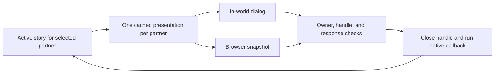

# The Companion Web Dashboard

## For end-users

### What it is

The dashboard is an optional browser companion for viewing your character and
using supported controls without opening every in-world menu. It is distinct
from the web portal, which only helps you link an outside service.

### How you open it

The **Web** button opens the test dashboard if you have been granted tester
access; otherwise it opens the published help. Pressing it again closes the
in-world browser. The **Tree** option on a character's profile is a separate
way to open that character's web view.

Testers can also choose **UI** from the **Start** menu before activating a
character. That option opens the dashboard again rather than toggling it closed.
It disappears if tester access is removed.

If an opening link has expired, open the view again from the companion.

### Closing the view and opening outside links

Where offered by the dashboard, the close control closes the in-world browser.
Opening an outside web link asks you to approve it in a separate viewer prompt;
it does not replace the dashboard or discard your pending scene choice. Review
the destination before accepting. If no prompt arrives, keep the companion worn
and allow it to reconnect before trying again.

### What you'll see

- **Live status** — whether your companion is currently active, and, while
  you're in an intimate scene, a mirrored, moment-by-moment narration of what's
  happening (so you can follow along even if you've stepped away from local
  chat).
- **Character sheet** — your name, species, gender, form, class, birthplace, and
  parents, plus your core stats (vitality, arousal, stamina, essence, strength,
  defense), fertility/pregnancy flags, and body growth.
- **Abilities** — any special ability your character currently has access to
  (for example, a shapeshifter's Shift ability, or Bite), with the same
  controls as the in-world menu.
- **Character details** — trusted characters, current partners, family, species,
  pregnancies, and histories. You can remove an existing trust or dissolve a
  partnership; dissolving it removes the relationship for both characters.
  Nearby partnership invitations and character-specific species overrides
  still use the in-world menus.
- **Genetics, pregnancies & births** — visibility depends on your character;
  see [Character histories](reproduction-and-genetics.md#viewing-character-histories).
  Pregnancy progress appears once development reaches 10%, with an estimated
  delivery time. Delivery itself remains in-world.
- **Species settings** — species owners can edit shared base settings, after
  acknowledging that other characters using the species will be affected;
  see [Editing a species](species-creation.md#editing-a-species-you-own).
- **Items & attachable devices** — a live scan of nearby usable items, and the
  same manage/attach/detach controls as the in-world menu for your worn
  attachable devices/plugins, including switching a device to manual
  **Override** so you can drive its controls yourself instead of letting it
  react automatically.
- **Settings** — the same account settings you'd change in-world (AI narrator
  preferences, privacy toggles, movement/RLV restrictions, access permissions),
  editable directly from the page.
- **Search & discovery** — other active characters nearby, online, or
  currently fertile, each with a compatibility percentage against your active
  character, plus a "Breed" button that sends the same breeding request the
  in-world Search menu would send.
- **World presence** — a snapshot of overall community activity: how many
  characters are online, the busiest regions, and the most common species.
- **Current location** — your latest reported region, separate from your
  character's recorded birthplace; it can be shown before activating a character.
- **Store** — supported browser controls list products, spend Credits, claim
  rewards, and clear unclaimed rewards; see
  [Using the browser Store](store-and-rewards.md#using-the-browser-store).

### Answering scene choices

When a supported scene prompt appears in the browser, you can answer there or
in-world. Both views represent the same choice: the first accepted answer
advances the scene, and an old prompt cannot be answered a second time.
Choices, confirmations, and short text replies are supported. If you have scenes
with multiple partners, each can retain its own pending choice. Check which
partner a prompt belongs to before answering; answering one does not consume
another partner's choice.

If a prompt expires or is replaced, use the current prompt instead. Refresh the
browser to recover a still-pending choice. If a text reply is rejected, try a
shorter reply. Opening a different in-world menu can dismiss the scene prompt;
touch the companion again to return to the scene.

Where the dashboard offers an emergency stop, it ends the selected engagement
only if your character initiated it, even while waiting for the partner's turn
or while tied. Other engagements remain active. See
[Stopping an engagement](interaction-lifecycle.md#stopping-an-engagement) for
the distinction from ordinary in-world controls.

### Changing characters and handling stale views

You can leave your active character from the dashboard while idle, then choose
a character to continue. Finish an active scene or delivery first. If you
switched characters or someone updated species settings while a page was open,
refresh it before trying again; an outdated page cannot apply those changes.

### Staying in sync

The dashboard uses recent companion activity to show whether you are present.
Keep the companion worn when using live controls. If it appears offline after
removal or a region change, wait for the companion to reconnect and refresh.

### Privacy & security

- Open your own web view from the companion rather than sharing opening links.
- Review confirmations carefully, especially when dissolving a partnership or
  changing a species used by other people.

---

## For developers

### Purpose & relationship to the frontend

The backend does not render the dashboard itself — it exposes a
JSON API backed by the account's restored application state that a separate
Next.js frontend (referred to throughout the
codebase's inline docs as `ane-ui-nextjs`, not part of this repository)
consumes to render the live dashboard. The user-facing descriptions above
describe supported interactions, not a verified inventory of deployed panels.

> **Verification boundary:** the frontend and its authentication/event bridge are
> not in this repository. Their rendering, polling interval, token consumption,
> and delivery of notifications cannot be established from this backend alone.

### Entry point & hand-off

- **`RunningState::touch_root()`** (`src/classes/states/RunningState.php`,
  `button09`) closes an already-open media browser; otherwise, it opens
  the destination selected by `WebUiHelper::open()`
  (`src/classes/helpers/WebUiHelper.php`): `Constants::HTTPS_ANEHUD_DOCS` unless
  the account explicitly holds `AccountRoleEnum::TESTER`. Testers instead open
  `HTTPS_ANEHUD_TEST_UI` with a signed token containing the account's `uuid` and
  `name`. Administrator status alone does not qualify. The default expiry is
  ten minutes.
- **`InitialState`** (`src/classes/states/InitialState.php`) adds `ACTION_UI`
  to the Start dialog only when `WebUiHelper::isTester()` is true. Selection
  checks the role again, so a stale selection after revocation returns the
  updated Start dialog without opening media or issuing a token. This path
  requires no active profile and always opens, rather than toggles, the browser.
- **`ProfileDialog::menu_profile_dialog()`** (`PROFILE_TREE` button) mints a
  short-lived signed token via `TokenHelper::createUrlToken()` carrying
  `target` (the profile id being viewed) and `viewer` (the caller's owner
  key), and opens `{ui.protocol}://{ui.host}/?token=<jwt>` in the in-world
  media browser (`MediaModule::openMediaBrowserAndDialog()`).
- **`TokenHelper`** (`src/classes/helpers/TokenHelper.php`) centralises JWT
  creation (`firebase/php-jwt`, `HS256`, signed with the `jwt.secret`
  application setting). `createToken()`/`createUrlToken()` always stamp
  `iat`/`exp` server-side (default TTL `DEFAULT_TTL_SECONDS` = 600s), so
  supplied `iat`/`exp` claims do not override those timestamps.
  It also exposes itself over the API (`on_api()`, routed via the `token`
  segment). This helper accepts arbitrary claims and any positive requested
  lifetime; it does not itself enforce a claim allowlist, a maximum lifetime,
  or one-time use. Authorization must not be inferred from token issuance.

### Request routing

Two complementary routing styles are used, both dispatched through the shared
framework's `ApiService`/`ApiEvent` machinery (`/api?...`) and matched to
`ApiSubscriber` implementations:

1. **Segmented dispatch (`ApiHelper`)** — `src/classes/helpers/ApiHelper.php`
   resolves `/api?class=ApiHelper&segments=state,account,profile,...` by
   splitting the `segments` query param and fanning each name out to a fixed
   helper (`state`, `account`, `headers`, `profile`, `species`, `plugins`,
   `genetics`, `fluids`, `stats`, `attachments`, `pregnancies`, `births`,
   `token`). Requested `state`/`account`/`headers` segments resolve in every
   state; other requested segments return null in `InitialState`.
   This is a state gate, not a substitute for each helper's ownership checks.
   An `outfits` segment name is also recognised
   but currently just returns an empty payload — it's a reserved placeholder,
   not a working panel yet.
2. **Direct per-class endpoints** — most dashboard panels are their own
   top-level `ApiSubscriber`, resolved by short class name
   (`/api?class=<ClassName>`), for example:
   - `StatusHelper` — `/api?class=StatusHelper`: the stable top-level poll
     endpoint (its inline contract suggests polling about every 10s).
     Returns the account's Second
     Life agent name (`agentName`, always present, even with no active
     character — used for a profile picture before a character exists), the
     current state-machine state (`resolveStateName()`), a rendered character
     summary (`renderCharacter()`, including `RenderHelper::renderProfileOf()`
     and the same stat block `AbstractAneState::on_broadcast(CHAN_BROADCAST_STATS)`
     uses), a `present` heartbeat flag, and — while `CopulateState` is active —
     a `copulation` block from `CopulateState::buildCopulationActivity()`.
     `present` is derived from the age of the header returned by `Application::getHeaders()`
     versus `StatusHelper::SESSION_HEADER_TTL_SECONDS` (300s); the backend owns
     this timeout and does not expose the raw age, only the boolean `present`
     flag. Top-level `region` comes from the latest header for the account's
     agent key via `HeaderRepositoryImpl::fetchLatestHeaderByKey()`, even
     without a character; missing data or lookup failure yields null.
     `character.region` remains the stored birth/spawn region and is not
     rewritten by polling. Region lookup has no freshness gate, so a region
     value alone must not be interpreted as current presence.
   - `AbilityHelper` / `AbilityShiftHelper` / `AbilityBiteHelper` — the Abilities panel; `AbilityHelper`
     reports Transmute (Shift) and Bite eligibility, resolved through the
     [default and species-specific ability grants](abilities.md) system, and
     `AbilityShiftHelper` drives the Shift ability's own detail surface,
     collapsing the in-world MyProfile → Abilities → Shift dialog tree.
     `AbilityBiteHelper` lists eligible nearby targets and applies Bite
     selections — see [Abilities](abilities.md) for how eligibility, range,
     and effects are resolved for both.
   - `AttachmentsHelper` — the Attachments panel; collapses
     `ProfileAttachmentDialog`'s Attach/Detach/Test flow and the generated
     `#[ControlMethod]` metadata (see
     [Third-Party Integrations](third-party-integrations.md#attachment-compatibility-layer))
     into one surface: `GET` returns the character's managed attachments
     (each with its controls/test methods and `overridden` flag) plus the
     remaining catalog and the account's attachment limit; `POST ?do=attach`/
     `?do=detach` manage which attachments a profile has; `POST ?do=override`
     toggles a single managed attachment's manual **Override** so a person can
     drive it directly instead of the automation; `POST ?do=control` and
     `POST ?do=method` send a slider/toggle/action control or a test command
     to an overridden attachment (both are rejected while Override is off).
     Also reachable as the `attachments` segment of `ApiHelper`, and mirrored
     at `/api?class=AttachmentService` for HUD sessions that were already
     serialized with that subscriber before this panel existed.
   - `ItemHelper` — the Items panel; wraps
     `ItemService::discoverItemObjects(notifyAgent: false, clearCache: true)`,
     the same scan as the in-world `touch → Items` button, with
     `notifyAgent` suppressed so it doesn't spam local chat.
   - `SettingHelper` — the account Settings page; collapses `SettingsDialog`'s
     blue-dialog tree into a schema-driven surface. `GET ?group=<name>`
     returns the group's field schema (label/description/type/bounds/default)
     merged with the currently stored value; `POST ?group=<name>` validates and
     persists submitted fields (range clamping/snapping, boolean coercion, text
     length/regex validation — the validation regex itself is stripped before
     being sent to the client) via `AccountSettingHelper`, applies any
     side-effect (e.g. immediately locking/unlocking the RLV detach point when
     the "Detachable" setting changes), then re-reads and returns the group so
     the client reconciles to the true stored state. Wired groups: `ai`
     (AI role-play narration limits), `privacy` (location broadcasting),
     `rlv` (movement/auto-strip/detachable/character-switching/relay
     restrictions), `access` (public access).
   - `DiscoveryHelper` — the Search panel; `/api?class=DiscoveryHelper&scope=<scope>`
     collapses the in-world Search dialog tree (Region/Global/Online/
     Garden/Fertile — see [Search & Discovery](search-and-discovery.md)) into
     one scoped endpoint. `region`/`online`/`fertile`
     return profile rows (name, species, gender, region, fertility, and
     lineage-aware breeding compatibility against the caller's active
     character via `SpeciesAffinityHelper`); `region` additionally carries
     proximity/`canCopulate` (whether a breeding request can be sent, mirroring
     `CopulateModule`'s in-world range gate); `global` returns busiest-region
     counts; `garden` returns an explicit "unavailable on the web" marker
     because it needs an in-world parcel/sensor scan.
   - `CopulateModule::on_api()` — `POST /api?class=CopulateModule&target=<agentKey>`:
     the Search panel's "Breed" button. Validates the target resolves to a
     real, currently-active character within `Constants::COPULATION_RANGE`,
     then calls the same `offerCopulate()` used by the in-world flow — the
     target still confirms (or auto-accepts, per their trust/relationship/access
     settings — see `CopulateModule::resolveAutoApprovalReason()` and
     [Accounts & Profiles](account-and-profiles.md)) before
     `CopulateState` is entered.
   - `WorldPresenceHelper` — the World Presence panel; aggregate community
     stats (`online` accounts, busiest `regions`, most-populous `species`),
     each section independently guarded so one failing query degrades
     gracefully instead of failing the whole payload.
   - `StoreHelper::on_api()` — account-scoped catalog, purchases, reward claims,
     and confirmed purge; registered on initialization and session restore.
     The older `StoreModule` remains a no-op stub. See
     [Browser Store requests](store-and-rewards.md#browser-store-requests) for
     inputs, transaction isolation, and retry/delivery boundaries.
   - `MediaHelper::on_api()` — owner-scoped closing and website prompts; see
     [Media controls](#media-controls).
   - `CopulationInteractionHelper::on_api()` — explicit initiator-only
     emergency stop for one existing engagement; see
     [Emergency-stop requests](interaction-lifecycle.md#emergency-stop-requests).
   - `RlvSharedFoldersModule` — a read-only listing
     (`list=folders|outfits|garments|all`) of the character's shared folders,
     current outfit, and worn/unworn garments, each flagged active/inactive;
     see [RLV-Driven Character & Outfit Control](rlv-and-control.md).

### Live scene mirroring

While a character is in `CopulateState`, `RolePlayService` buffers narrated
prose, whispers, and a small set of sequenced events (climax, conception) in
per-request/session ("Application meta") scratch storage — `SCENE_TRANSCRIPT`
/ `SCENE_EVENTS` (capped at 80/24 entries) — purely so `StatusHelper`'s
`copulation` block can mirror the running scene to the dashboard. This is
intentionally **not persisted**: it's cleared on state entry/exit, unlike the
`ChoiceStory` history retention used for the AI companion (see
[The AI Role-Play Companion](ai-companion.md)).

### Media controls

`MediaHelper` (`src/classes/helpers/MediaHelper.php`) handles POST at
`/api?class=MediaHelper`, with an `action` in the request body:

- `close` calls the current session's `MediaModule::closeMediaBrowser()`.
- `open-url` requires a string `url` of at most 2,048 bytes, validated as an
  absolute HTTP or HTTPS address with no embedded username/password, literal
  spaces, or control characters. Other schemes and malformed inputs are
  rejected. The destination is not restricted to a host allowlist; validation
  is not an endorsement of the destination.

A valid link queues `DialogWebsite` for the current account's agent key,
ignoring a supplied recipient. It does not fetch the URL server-side or navigate
the media surface. `AbstractAneState::catchAction()` bypasses interaction-dialog
replacement for `DialogWebsite`, preserving both the saved menu and story
prompt. `ok: true` acknowledges the queued action, not a confirmed user visit.
Unsupported verbs/actions and invalid URLs return `ok: false` with an error.

`tests/integration/helpers/MediaHelperTest.php` covers request validation and
registration; `tests/e2e/cases/MediaWebLinkQueuesOwnerWebsiteDialogTest.php`
checks owner routing and preservation of the current prompt. Tester entry and
location behavior are covered by
`tests/e2e/cases/WebButtonTesterRoleRoutesSignedTokenTest.php` and
`tests/e2e/cases/StatusRegionFollowsHeaderPreservesBirthRegionTest.php`.

> **Restored-session boundary:** `MediaHelper` and `DialogInteractionHelper`
> are subscribed in `AbstractAneState::on_initialized()` but are not explicitly
> added in `__unserialize()`, unlike the Store and emergency-stop helpers.
> Whether a session saved before their introduction discovers them without
> reinitialization depends on the shared framework and needs verification.

### Character detail requests

`MyCharacterHelper::on_api()` (`src/classes/helpers/MyCharacterHelper.php`) is a
direct subscriber at `/api?class=MyCharacterHelper`, registered during
`AbstractAneState::on_initialized()` and re-registered during `__unserialize()`
so existing serialized sessions can use it without restarting.

Every request resolves the authenticated account's active profile and requires
an exact `characterId` match: in query parameters for GET and in the body for
POST. This is a stale-view guard, not a way to select another account's profile.
Missing profiles, unsupported verbs, unknown sections, and unavailable actions
return errors; unexpected failures are logged with a generic client message.

| Section | Read behavior | Supported POST action |
|---|---|---|
| `trusts` | Current trusted profiles and removal actions. | `revoke-trust`, targeting an existing trusted profile. |
| `partners` | Living current partners with relationship date. | `dissolve-partnership`, targeting a current relation; both directions are removed transactionally. |
| `family` | Recorded parents, visible births, children, siblings sharing an actual parent, and adoption relations. | None. |
| `species` | Base identity, effective reproductive specifics, separate base specifics when overridden, and an owner-only settings panel. | `save-species-settings`; see [Species creation](species-creation.md#editing-base-species-settings). |
| `pregnancies` | Only pregnancies at least 10% developed, sorted by expected delivery, with bounded progress, UTC estimate, remaining days, and developing/labor/delivery status. Hidden early pregnancies are excluded from the count too. | None. |
| `change` | Race and gender summary plus directions back to the HUD. | None. |
| `genetics`, `births` | Delegates to the read-only history helpers. | None; see [History APIs](reproduction-and-genetics.md#history-api-visibility). |
| `profile` | No GET panel in this helper. | `switch-character`, only in `RunningState`; transactionally leaves the current profile and checks arrival in `InitialState`. |

GET panels use `groups` with labelled `details`, `entries`, and action metadata.
Most mutations require a nonempty `targetId` in addition to `characterId`; the
switch action does not. The frontend must re-read panels after successful
mutations rather than assuming a submitted action is still available.

### Shared story dialogs

`DialogInteractionHelper` (`src/classes/helpers/DialogInteractionHelper.php`)
exposes `/api?class=DialogInteractionHelper`. Unlike a separate web workflow,
this surface calls the same native story callback as the HUD.

1. `AbstractAneState::catchAction()` captures a dialog addressed to the account
   owner. `DialogInteractionHelper` keeps one prompt per partner in session
   metadata plus a default/current pointer. A new story prompt replaces only
   that partner's previous prompt. A non-story menu closes the default prompt,
   not the entire registry; website prompts are exempt from replacement.
2. The `WebDialog` interface and `WebDialogTrait` (`src/interfaces/actions/`,
   `src/traits/`) opt the four wrappers in `src/classes/actions/interact/` into
   shared presentation. Stories bind the dialog before `CopulateState` wraps
   callbacks. Only a dialog belonging to a currently active story in
   `CopulateState`, with an existing shared engagement, has a visible snapshot.
3. Rendering is cached for that presentation, including generated AI choices.
   Its snapshot contains `id`, partner `targetId`, `kind` (`buttons` or `text`),
   decoded `message`, exact rendered `buttons`, and nullable UTC `expiresAt`.
   Redis open/close events use `Constants::REDIS_INTERACTION_EVENT`, routed to
   the owner; close events identify the handle with `dialogId`.
4. GET returns `dialog` or null, recovering the session-owned prompt if an
   event was missed. GET and POST accept an optional **query** `targetId`
   (string or integer) to select the partner; omitting it uses the default
   prompt, not an aggregate of all prompts. Older sessions' single saved prompt
   is recovered if its partner matches. POST accepts body fields `dialogId` and
   `response`; a handle from another partner is stale for the selected target.
   Button replies must exactly match a rendered label; text is limited to
   **250 bytes**, not characters. Web callers cannot submit `TIMEOUT`.
5. The accepted reply closes and removes its handle before invoking the native
   callback, with `CopulateState::process_story_action()` restoring the bound
   story's partner context. Other partners' handles remain usable. Any follow-up
   is queued and rendered, and POST returns
   `accepted: true` plus the next snapshot. Rejected submissions return
   `accepted: false`, a `stale` or `invalid` reason, and the current snapshot.

Pagination and re-presentation assign a fresh handle. Story removal closes that
partner's dialog; leaving `CopulateState` closes all dialogs. The last 64 closed handles are retained
so late HUD responses are ignored rather than treated as missing methods.
Expired prompts are not returned as active; timeout callbacks still come from
the HUD. This is not a blanket web mirror of every menu.

`tests/e2e/cases/StoryDialogChoicesShareCallbackAndRejectStaleResponsesTest.php`
covers cross-client duplicate replies, owner checks, pagination, replacement,
expiry, text byte limits, AI-generated dialogs, and serialization recovery.
`tests/e2e/cases/CopulationEmergencyStopPreservesOtherEngagementTest.php`
also verifies cross-partner handle rejection, answering a non-default prompt,
and preserving another partner's prompt after a stop.

### Security notes

- All JWTs are signed with the `jwt.secret` application setting. The token
  helper's optional positive `ttl` parameter can exceed the default lifetime;
  caller-supplied claims and replay/expiry policy require review at the
  consuming authentication boundary, which is outside this repository.
- `ApiHelper` suppresses most segments in `InitialState`. This is not a
  blanket authorization policy for direct endpoints: each subscriber must
  enforce its own account/profile scope.
- `SettingHelper` strips server-only validation regexes from its schema
  response and clamps/validates every submitted value before persisting, so a
  malformed or malicious dashboard request can't write out-of-range or
  unvalidated settings.

### Extension points

- **New dashboard panel:** add a class implementing `ApiSubscriber` (either a
  new `helpers/*Helper.php` resolved directly by class name, or a new segment
  wired into `ApiHelper`), subscribe it alongside `StatusHelper` in
  `AbstractAneState::on_initialized`, and have the frontend poll/call it.
- **New settings group:** add a `*Schema()` method and a `match` arm in
  `SettingHelper::schemaFor()`, following the existing field shape
  (`key`/`label`/`description`/`type`/bounds or `maxLength`+`validate`
  /`default`).

See [Architecture](architecture.md) for how this fits into the overall
architecture, and [The Web Portal](web-portal.md) for the separate credential
hand-off flow.
